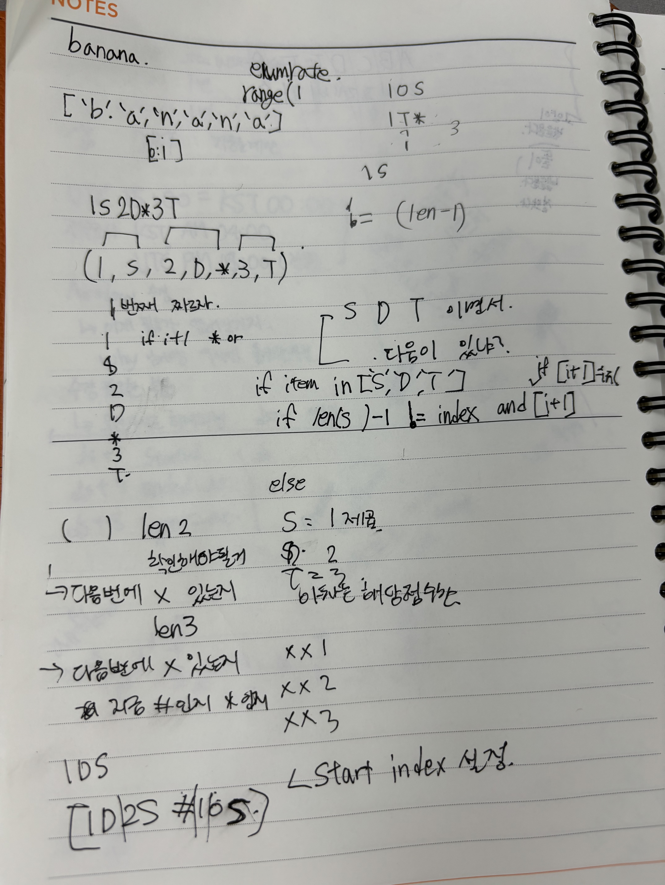

# 다트 게임 점수 계산

## 문제 설명
다트 게임은 총 3번의 기회로 구성된다. 각 기회마다 얻을 수 있는 점수는 0점에서 10점까지이다. 점수와 함께 Single(S), Double(D), Triple(T) 영역이 존재하며 각 영역 당첨 시 점수에서 1제곱, 2제곱, 3제곱으로 계산된다. 옵션으로 스타상(*)과 아차상(#)이 존재하며, 스타상(*) 당첨 시 해당 점수와 바로 전에 얻은 점수를 각 2배로 만든다. 아차상(#) 당첨 시 해당 점수는 마이너스된다. 

- 스타상(*)은 첫 번째 기회에서도 나올 수 있다. 이 경우 첫 번째 스타상(*)의 점수만 2배가 된다.
- 스타상(*)의 효과는 다른 스타상(*)의 효과와 중첩될 수 있다. 이 경우 중첩된 스타상(*) 점수는 4배가 된다.
- 스타상(*)의 효과는 아차상(#)의 효과와 중첩될 수 있다. 이 경우 중첩된 아차상(#)의 점수는 -2배가 된다.

## 입력 형식
"점수|보너스|[옵션]"으로 이루어진 문자열 3세트.
예) 1S2D*3T

- 점수는 0에서 10 사이의 정수이다.
- 보너스는 S, D, T 중 하나이다.
- 옵션은 *이나 # 중 하나이며, 없을 수도 있다.

## 출력 형식
3번의 기회에서 얻은 점수 합계에 해당하는 정수값을 출력한다.
예) 37

## 입출력 예제
| 예제 | dartResult    | answer | 설명                                    |
|------|---------------|--------|-----------------------------------------|
| 1    | 1S2D*3T      | 37     | (1^1) * 2 + (2^2) * 2 + (3^3)          |
| 2    | 1D2S#10S     | 9      | (1^2) + (2^1) * (-1) + (10^1)          |
| 3    | 1D2S0T       | 3      | (1^2) + (2^1) + (0^3)                  |
| 4    | 1S*2T*3S     | 23     | (1^1) * 2 * 2 + (2^3) * 2 + (3^1)      |
| 5    | 1D#2S*3S     | 5      | (1^2) * (-1) * 2 + (2^1) * 2 + (3^1)   |
| 6    | 1T2D3D#      | -4     | (1^3) + (2^2) + (3^2) * (-1)           |
| 7    | 1D2S3T*      | 59     | (1^2) + (2^1) * 2 + (3^3) * 2           |

## 프리코딩(pre-coding) 스케치

